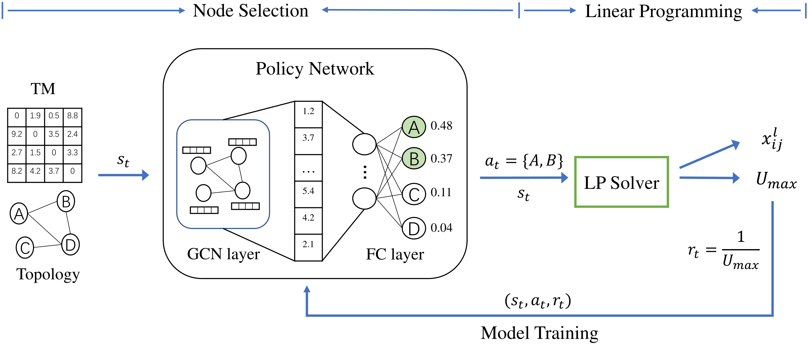

# DRL-NS

Implementation of paper: _Accelerating Traffic Engineering in Segment Routing Networks: A Data-Driven Approach (ICC 2022)_

This work selects nodes / tunnels with deep reinforcement learning (DRL) before solving linear programming (LP) problems to accelerate traffic engineering (TE) in Segment Routing (SR) networks.



## Usage

To fully reproduce the result, you should

1. Install dependencies with their specific versions described in `requirements.txt`
2. Prepare data of network topology and traffic matrices, 
   in format which can be read by `Traffic` and `Topology` classes in `sr.py` (data used in paper will be available soon)
3. Config in `config.py`
4. Train and test with `train.py` and `compare.py`

## TODO

- [ ] Publish source code of journal version of this work (to appear), which runs faster.
- [ ] Publish data and trained models used in paper

## Cite

Paper link: <https://ieeexplore.ieee.org/document/9839109>

If you find it helpful, please cite:

```bib
@inproceedings{wang22,
  author    = {Wang, Linghao and Wang, Miao and Zhang, Yujun},
  booktitle = {ICC 2022 - IEEE International Conference on Communications},
  title     = {Accelerating Traffic Engineering in Segment Routing Networks: A Data-driven Approach},
  year      = {2022},
  volume    = {},
  number    = {},
  pages     = {1704-1709},
  doi       = {10.1109/ICC45855.2022.9839109}
}
```
